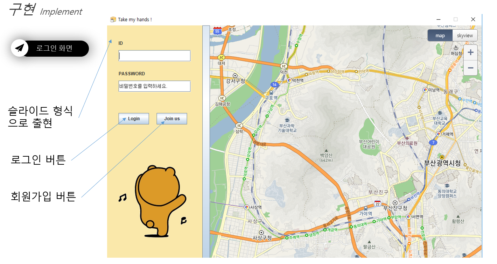

# Take_my_hand(내손을 자바)
2학년 2학기 JAVA 팀 프로젝트, Kakao Map API, Socket, 공공데이터 API Parsing, Login, JAVA Swing

## Contributor
- inhwan Jeong 정인환(ghjklla007@naver.com)
- donghyun Kim 김동현
- minsu Kim 김민수
- junhong Ahn 안준홍
- jeonghyun Jeong 정정현

 
 

## 프로젝트 소개

 
 

## 프로젝트 계획

 
 

## 프로젝트 결과

